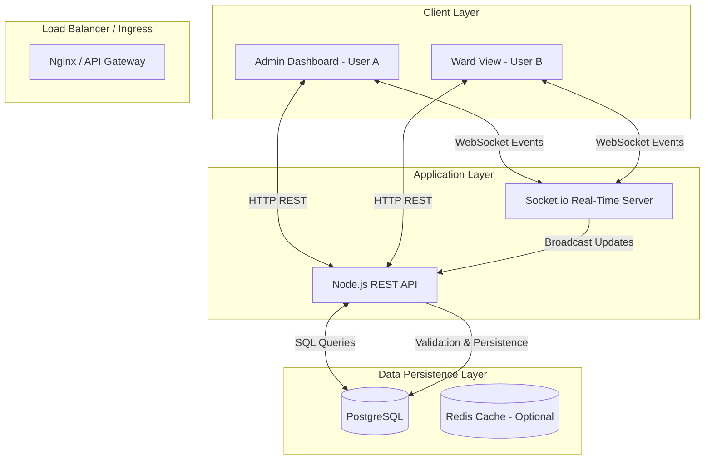

# IsoGrid
## High-Concurrency Distributed Bed Allocation System

**Author**: Laksharaj Jha
**Date**: December 2025

---

## 1. Executive Summary

**The Problem**: In infectious disease wards, insufficient isolation buffers between patients significantly increase the risk of nosocomial (hospital-acquired) transmission. Standard bed booking systems treat allocation as a binary problem (Occupied vs. Empty), failing to account for spatial proximity risks.

**The Solution**: IsoGrid is a specialized distributed system designed to minimize cross-contamination. It introduces a **Spatial Adjacency Engine** that treats the ward as a 2D matrix. The system enforces safety constraints by locking not only the occupied bed but also recursively flagging adjacent "Risk Zones" in real-time. This is powered by a hybrid architecture combining WebSocket synchronization for immediate user intent ("Ghost Locking") with ACID-compliant database properties for data integrity.

---

## 2. System Architecture

IsoGrid utilizes a **Hybrid Client-Server-Event** architecture. This ensures that while the source of truth remains the relational database, user interactions are synchronized with millisecond latency to prevent cognitive dissonance during high-load scenarios.

### Architectural Diagram



---

## 3. Database Schema Strategy

The schema is designed to enforce referential integrity while optimizing for spatial queries.

### Entity Relationship Model

1.  **Wards**
    *   `id` (PK): Integer
    *   `name`: String
    *   `dimensions`: `{ row: integer, col: integer }` (JSONB)

2.  **Beds**
    *   `id` (PK): Integer
    *   `ward_id` (FK): Integer
    *   `row`: Integer
    *   `col`: Integer
    *   `status`: Enum (`AVAILABLE`, `OCCUPIED`, `MAINTENANCE`)
    *   `type`: Enum (`STANDARD`, `ICU`, `ISOLATION`)
    *   **Index**: Composite Index on `(ward_id, row, col)` ensures O(1) lookup speed for specific coordinate queries.

3.  **Patients**
    *   `id` (PK): Integer
    *   `bed_id` (FK): Integer (Unique - One-to-One with Beds)
    *   `condition`: Enum (`INFECTIOUS`, `NON_INFECTIOUS`)
    *   `admission_date`: Timestamp
    *   `vitals`: JSONB (Stores simulated telemetry data)

### Spatial Optimization
Instead of geospatial libraries (PostGIS), we utilize a normalized matrix coordinate system (`row`, `col`). This allows "Risk Zone" calculation to be performed as simple arithmetic operations (`row ± 1`, `col ± 1`) directly in the application layer or via stored procedures, reducing overhead for dense grids.

---

## 4. Concurrency & Safety Engine

To handle high concurrency (e.g., pandemic triage scenarios), IsoGrid employs a **Two-Layer Locking Strategy**.

### Layer 1: Optimistic "Ghost Locking" (User Intent)
**Mechanism**: WebSocket Broadcast
**Purpose**: UX De-confliction.
When a user hovers over a bed, the client emits a `enter-hover` event. The server broadcasts this to all other connected clients, rendering the bed as "Locked by User X" (Ghost Lock).
*   **Latency**: < 50ms.
*   **Guarantee**: Weak (Eventual Consistency). Prevents users from *attempting* to book the same bed 99% of the time.

### Layer 2: Pessimistic Transactional Locking (Data Integrity)
**Mechanism**: `SERIALIZABLE` or `REPEATABLE READ` Isolation.
**Purpose**: Hard Constraint Enforcement.
When a booking is submitted:
1.  **Transaction Start (`BEGIN`)**.
2.  **Neighbor Scan**: Query the status of 4-neighborhood (Von Neumann neighborhood).
    ```sql
    SELECT status, condition FROM beds 
    JOIN patients ON beds.id = patients.bed_id
    WHERE ward_id = ? AND (
       (row = target_row + 1 AND col = target_col) OR ...
    )
    FOR UPDATE; -- Row-level lock
    ```
3.  **Constraint Check**: If any neighbor is `INFECTIOUS`, rollback and throw `ContagionRiskError`.
4.  **Commit**: If safe, update status and commit.

---

## 5. "Contagion Ripple" Algorithm

This recursive algorithm ensures that a status change propagates safety constraints instantly.

**Trigger**: Patient Condition Update (Normal -> Infectious)
**Process**:
1.  **Identify Zero Point**: The bed containing the infectious patient.
2.  **Calculate Vector Field**: Determine the set of immediate neighbors `N = {(x±1, y), (x, y±1)}`.
3.  **State Mutation**:
    *   If `n ∈ N` is `AVAILABLE`, lock it as `BLOCKED (Risk Zone)`.
    *   If `n ∈ N` is `OCCUPIED`, flag for "Critical Transfer".
4.  **Broadcast**: Emit `ward-updated` socket event with the new metadata hash.

---

## 6. Future Scalability Roadmap (Theoretical)

*Design specification for scaling to 10M concurrent users.*

### 6.1 Database Sharding
**Strategy**: Horizontal Partitioning by `ward_id`.
Since cross-ward interactions are rare (only during transfers), each Ward can exist on an independent shard.
*   **Shard Key**: `ward_id`.
*   **Routing**: Application-level logic directs queries to `DB_Shard_A` (Wards 1-1000) or `DB_Shard_B` (Wards 1001-2000).

### 6.2 Caching Strategy
**Component**: Redis.
**Data Structure**: Bitfield or 2D Array per Ward.
Instead of querying SQL for every view, the entire Ward Matrix (`100x100`) is cached in Redis.
*   **Reads**: O(1) from Redis.
*   **Writes**: Write-Through (Update DB -> Update Redis).

### 6.3 Asynchronous Event Bus
**Component**: RabbitMQ / Apache Kafka.
Decouple the "Contagion Ripple" calculation from the main request thread.
*   **Producer**: `PatientService` publishes `PATIENT_INFECTED` event.
*   **Consumer**: `NotificationService` consumes event -> Pushes SMS/Email alerts to staff -> Triggers audit log archival.

---

## 7. API Specifications

### Core Endpoints

#### `GET /api/wards/:id/beds`
*   **Description**: Fetches the complete state of the ward matrix.
*   **Response**: Array of Bed objects including nested Patient data.

#### `POST /api/patients/admit`
*   **Body**: `{ name, age, condition, bedId }`
*   **Constraints**: Validates Adjacency Logic. Returns `409 Conflict` if bed is in a Risk Zone.

#### `POST /api/patients/transfer`
*   **Body**: `{ patientId, targetBedId }`
*   **Logic**: Atomic transaction. `UPDATE old_bed SET status='AVAILABLE'; UPDATE new_bed SET status='OCCUPIED';`

#### `PUT /api/patients/:id/condition`
*   **Body**: `{ condition: 'INFECTIOUS' }`
*   **Effect**: Triggers the Contagion Ripple calculation and WebSocket broadcast.
